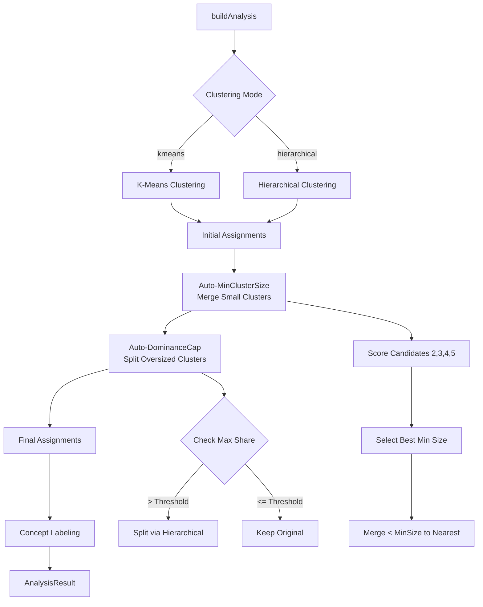
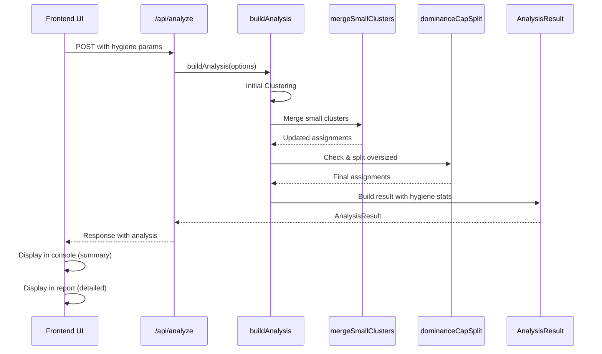

# Cluster Hygiene Knobs Implementation Plan

## Overview

Implement two cluster hygiene features to improve clustering quality:

1. **Auto-MinClusterSize**: Automatically select minimum cluster size based on corpus size (with scoring), then merge small clusters into nearest larger clusters
2. **Auto-DominanceCap**: Automatically detect and split clusters exceeding dominance threshold (default 35%) using hierarchical sub-clustering

Both features apply to kmeans and hierarchical modes, with separate checks for primary and detail layers in two-layer hierarchical mode.---

## Architecture Overview



---

## Backend Implementation

### 1. Type Definitions

**File: `types/analysis.ts`**Add to `AnalysisResult` interface:

- `minClusterSize?: number` - Applied minimum cluster size
- `minClusterSizeAuto?: boolean` - Whether auto-selection was used
- `minClusterSizeMerged?: number` - Number of clusters merged
- `minClusterSizeDetails?: { beforeSize: number; afterSize: number; mergedCount: number }` - Merge statistics
- `dominanceSplitApplied?: boolean` - Whether split was applied
- `dominanceSplitDetails?: { primary?: { splitCount: number; originalSizes: number[]; newSizes: number[] }; detail?: { splitCount: number; originalSizes: number[]; newSizes: number[] } }` - Split statistics

**File: `types/api.ts`**Add to `AnalyzeRequest` interface:

- `autoMinClusterSize?: boolean` - Enable auto min cluster size (default: false)
- `minClusterSize?: number` - Manual override for min cluster size
- `autoDominanceCap?: boolean` - Enable auto dominance cap (default: true)
- `autoDominanceCapThreshold?: number` - Override threshold (default: 0.35)

### 2. Core Logic Implementation

**File: `lib/analysis/cluster-eval.ts`**Add new functions:**`selectOptimalMinClusterSize(vectors: Float64Array[], candidates: number[]): number`**

- Evaluate candidates {2,3,4,5} by simulating merges and scoring
- Score based on: cluster coherence, separation, balance (avoid too few/far too many clusters)
- Return best candidate

**`mergeSmallClusters(assignments: number[], vectors: Float64Array[], minSize: number): { assignments: number[]; mergedCount: number; details: Array<{ from: number; to: number; size: number }> }`**

- Identify clusters below minSize
- For each small cluster, find nearest larger cluster (cosine similarity between centroids)
- Reassign items from small clusters to nearest larger clusters
- Return updated assignments and merge statistics

**File: `lib/graph/graph-builder.ts`Modify `buildAnalysis` function:**

1. **Add option parameters** (lines 49-89):

- `autoMinClusterSize?: boolean` (default: false)
- `minClusterSize?: number` (optional manual override)
- `autoDominanceCap?: boolean` (default: true)
- `autoDominanceCapThreshold?: number` (default: autoKDominanceThreshold or 0.35)

2. **After initial clustering (after line 514 for kmeans, after line 508 for hierarchical)**:

**Step A: Apply MinClusterSize merge**

   ```typescript
         if (autoMinClusterSize || minClusterSize !== undefined) {
           const resolvedMinSize = minClusterSize ?? 
             selectOptimalMinClusterSize(semanticVectors, [2,3,4,5]);
           const mergeResult = mergeSmallClusters(assignments, semanticVectors, resolvedMinSize);
           assignments = mergeResult.assignments;
           K = new Set(assignments).size;
           centroids = computeCentroids(semanticVectors, assignments, K);
           log("quality", `MinClusterSize: merged ${mergeResult.mergedCount} clusters (minSize=${resolvedMinSize})`);
         }
   ```


3. **Enhance dominance cap logic (lines 516-568)**:

- Replace hardcoded `capShare = 0.35` with `autoDominanceCapThreshold ?? autoKDominanceThreshold ?? 0.35`
- Add toggle check: `if (!autoDominanceCap) { skip split logic }`
- Apply to two-layer mode:
    - Check primary layer after primary cut
    - Check detail layer after detail cut (if exists)
- Store split statistics in result
- Update log messages to use quality log type

4. **Store results in AnalysisResult**:

- Set `minClusterSize`, `minClusterSizeAuto`, `minClusterSizeMerged`, `minClusterSizeDetails`
- Set `dominanceSplitApplied`, `dominanceSplitDetails`

### 3. API Route Updates

**File: `app/api/analyze/route.ts`**Extract from request body:

- `autoMinClusterSize`
- `minClusterSize`
- `autoDominanceCap`
- `autoDominanceCapThreshold`

Pass to `buildAnalysis` options object.---

## Frontend Implementation

### 1. State Management

**File: `app/page.tsx`**Add state variables (near line 73-96):

```typescript
const [autoMinClusterSize, setAutoMinClusterSize] = useState(false);
const [minClusterSize, setMinClusterSize] = useState<number | undefined>(undefined);
const [autoDominanceCap, setAutoDominanceCap] = useState(true);
const [autoDominanceCapThreshold, setAutoDominanceCapThreshold] = useState<number | undefined>(undefined);
```

Add to analysis request payload (near line 315-370).Add to dependency array for analysis effect (near line 497).

### 2. UI Controls Component

**File: `components/controls/AnalysisControls.tsx`Add props to interface (lines 33-97):**

- `autoMinClusterSize: boolean`
- `onAutoMinClusterSizeChange: (value: boolean) => void`
- `minClusterSize?: number`
- `onMinClusterSizeChange: (value?: number) => void`
- `autoDominanceCap: boolean`
- `onAutoDominanceCapChange: (value: boolean) => void`
- `autoDominanceCapThreshold?: number`
- `onAutoDominanceCapThresholdChange: (value?: number) => void`

**Add UI section (after Auto-Seed Settings, around line 470):**Create new collapsible section "Cluster Hygiene" within "Advanced Engine Settings" accordion:

- Toggle: "Auto Min Cluster Size" with switch
- When enabled: Show "Min Cluster Size" input (optional override)
- Toggle: "Auto Dominance Cap" with switch (default: on)
- When enabled: Show "Dominance Threshold" slider (optional override, default: 0.35)

**Styling:** Match existing accordion pattern (nested within "Advanced Engine Settings").

### 3. Controls Accordion Wrapper

**File: `components/controls/AnalysisControlsAccordion.tsx`**Add props to interface (lines 9-75) and pass through to `AnalysisControls`.

### 4. Console Logging Integration

**File: `app/page.tsx`In `addLog` callback (lines 153-178):**

- No changes needed (uses existing log entry structure)

**After analysis completes (useEffect around line 227):**

- Check `analysis.minClusterSizeMerged` and log summary:
  ```typescript
      if (analysis.minClusterSizeMerged && analysis.minClusterSizeMerged > 0) {
        addLog("quality", `Cluster hygiene: merged ${analysis.minClusterSizeMerged} small clusters (minSize=${analysis.minClusterSize})`);
      }
      if (analysis.dominanceSplitApplied) {
        const primarySplits = analysis.dominanceSplitDetails?.primary?.splitCount ?? 0;
        const detailSplits = analysis.dominanceSplitDetails?.detail?.splitCount ?? 0;
        if (primarySplits > 0 || detailSplits > 0) {
          addLog("quality", `Cluster hygiene: applied dominance splits (primary: ${primarySplits}, detail: ${detailSplits})`);
        }
      }
  ```


**Log types:** Use `"quality"` type (already defined in InspectorConsole, shows ✓ icon, green color).

### 5. Analysis Report Display

**File: `components/inspector/AnalysisReport.tsx`In parameters section (around line 487):**

- Add to parameter list:
  ```javascript
      autoMinClusterSize: ${p.autoMinClusterSize ?? false} | minClusterSize: ${p.minClusterSize ?? "auto"}
      autoDominanceCap: ${p.autoDominanceCap ?? true} | dominanceCapThreshold: ${p.autoDominanceCapThreshold ?? "default"}
  ```


**Add new section after "Auto-K Search Metrics" (around line 780):"Cluster Hygiene Results" section:**

- Show minClusterSize info:
- Badge: "Min Cluster Size: {value} {auto/manual}"
- If merged > 0: Table showing before/after cluster counts
- Show dominance split info:
- If split applied: Table showing which layers were split, original sizes, new sizes
- Display threshold used

**Styling:** Match existing section styling (rounded borders, badges, tables).

### 6. Graph Visualization

**File: `components/graph/GraphCanvas3D.tsx` (if exists) / Graph renderingNo changes required:**

- Merged/split clusters will naturally reflect in node sizes (concept nodes use `concept.size`)
- Node labels and connections update automatically via AnalysisResult
- Force simulation adjusts automatically to new cluster counts

---

## Data Flow



---

## Implementation Steps

1. **Backend Types** - Update `types/analysis.ts` and `types/api.ts`
2. **Core Logic** - Implement `selectOptimalMinClusterSize` and `mergeSmallClusters` in `cluster-eval.ts`
3. **Integration** - Modify `buildAnalysis` to apply hygiene features
4. **API Route** - Update `app/api/analyze/route.ts` to accept new params
5. **Frontend State** - Add state variables in `app/page.tsx`
6. **UI Controls** - Add controls section in `AnalysisControls.tsx`
7. **Console Logging** - Add summary logs in `app/page.tsx`
8. **Report Display** - Add hygiene results section in `AnalysisReport.tsx`
9. **Testing** - Verify with various corpus sizes and clustering modes

---

## Key Design Decisions

- **Merge Strategy**: Nearest-centroid assignment (preserves semantic coherence)
- **Auto Selection**: Scoring-based evaluation of {2,3,4,5} candidates
- **Scope**: Both kmeans and hierarchical modes, both layers in two-layer mode
- **Logging**: Summary in console, detailed breakdown in analysis report