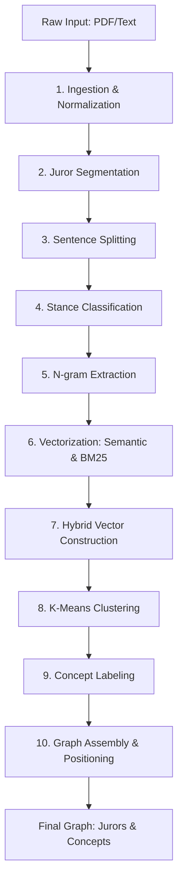

# SemiChan Pipeline Documentation: From Input to Output

This document provides a comprehensive overview of how raw input (text or PDF) is transformed into the final graph visualization in SemiChan.

## Pipeline Overview

The following diagram summarizes the data flow:



## Simulation Setup: Example Sentences
To demonstrate the pipeline, we will track two specific sentences from the corpus through every transformation:

**Juror 1: Sarah Broadstock**
*Full Comment:* "I appreciated the careful attention to daylight and the sun path. The proposal is strong in its narrative, but the site response could be clearer. The plan feels tight and circulation could be improved."
*Tracking Sentence A:* **"I appreciated the careful attention to daylight and the sun path."**

**Juror 2: Sandra Baggerman**
*Full Comment:* "The geometry creates unique light conditions; indirect lighting and shadows form a serene atmosphere. The sustainability strategy would benefit from clearer explanation."
*Tracking Sentence B:* **"The geometry creates unique light conditions; indirect lighting and shadows form a serene atmosphere."**

---

## Step 1: Input Ingestion
**Plain Language:** The system accepts text or PDF files and prepares them for analysis by cleaning up the formatting.

**Technical Detail:** For PDF uploads, the system uses the PDF.js library to parse the document, iterating through each page to extract raw text content via the `getTextContent` method. Once extracted, the text (or direct paste input) is processed by a `normalizeWhitespace` utility that uses regular expressions to collapse multiple spaces, replace carriage returns with standard newlines, and trim extraneous leading or trailing whitespace.

**Location:** `lib/pdf/pdf-parser.ts` (`parsePdf`), `lib/utils/text-utils.ts` (`normalizeWhitespace`)

### Explanation
The ingestion phase handles different input types. For PDFs, it iterates through pages, extracts text items, and joins them. All text then passes through `normalizeWhitespace` which replaces carriage returns, collapses multiple spaces, and trims the result.

### Example Tracking
*   **Sentence A:** "I appreciated the careful attention to daylight and the sun path."
*   **Sentence B:** "The geometry creates unique light conditions; indirect lighting and shadows form a serene atmosphere."
*   **State:** A single normalized string containing the full text of all jurors, with consistent `\n` line endings and no double spaces.

---

## Step 2: Juror Segmentation
**Plain Language:** The system identifies who said what by looking for juror names as headers.

**Technical Detail:** The system employs a heuristic `looksLikeName` function that analyzes lines for specific metadata patterns: it checks for a word count between 2 and 5, proper capitalization of each word, absence of trailing punctuation (like periods or colons), and a total length between 6 and 60 characters. A look-ahead mechanism confirms a line is a header if the subsequent non-empty line does *not* look like another name, allowing for robust segmentation of different juror comments into discrete `JurorBlock` objects.

**Location:** `lib/segmentation/juror-segmenter.ts` (`segmentByJuror`, `looksLikeName`)

### Explanation
The segmenter splits the text by lines and uses `looksLikeName` to find potential headers (checking for capitalization patterns and length). It flushes a buffer whenever a new name is found, assigning the collected text to the previous name. Small stray blocks are merged into an "Unattributed" category.

### Example Tracking
*   **Sentence A (Sarah Broadstock):** "I appreciated the careful attention to daylight and the sun path. The proposal is strong in its narrative, but the site response could be clearer. The plan feels tight and circulation could be improved."
*   **Sentence B (Sandra Baggerman):** "The geometry creates unique light conditions; indirect lighting and shadows form a serene atmosphere. The sustainability strategy would benefit from clearer explanation."
*   **State:**
```json
[
  { "juror": "Sarah Broadstock", "text": "I appreciated the careful attention to daylight and the sun path. The proposal is strong in its narrative, but the site response could be clearer. The plan feels tight and circulation could be improved." },
  { "juror": "Sandra Baggerman", "text": "The geometry creates unique light conditions; indirect lighting and shadows form a serene atmosphere. The sustainability strategy would benefit from clearer explanation." }
]
```

---

## Step 3: Sentence Splitting
**Plain Language:** Large blocks of juror text are broken down into individual sentences.

**Technical Detail:** The segmentation process uses a sophisticated regex-based splitting strategy: `(?<=[.!?])\s+(?=[A-Z(""'])`. This regex looks for punctuation (period, exclamation, or question mark) followed by whitespace, but only triggers a split if the next character is a capital letter or an opening quote, which prevents splitting on abbreviations like "St." or "Init.". Additionally, the system performs a secondary split on semicolons (`;`) to isolate individual architectural critiques that are often joined in complex sentences.

**Location:** `lib/nlp/sentence-splitter.ts` (`sentenceSplit`)

### Explanation
The splitter identifies sentence boundaries while preserving fragments. It specifically looks for punctuation followed by spaces and a capital letter. It also treats semicolons as secondary split points to handle complex architectural critiques. Very short boilerplate fragments are pruned.

### Example Tracking
*   **Sentence A (Sarah Broadstock::0):** "I appreciated the careful attention to daylight and the sun path."
*   **Sentence B1 (Sandra Baggerman::0):** "The geometry creates unique light conditions"
*   **Sentence B2 (Sandra Baggerman::1):** "indirect lighting and shadows form a serene atmosphere."
*   **State:**
```json
[
  { "id": "Sarah Broadstock::0", "juror": "Sarah Broadstock", "sentence": "I appreciated the careful attention to daylight and the sun path." },
  { "id": "Sandra Baggerman::0", "juror": "Sandra Baggerman", "sentence": "The geometry creates unique light conditions" },
  { "id": "Sandra Baggerman::1", "juror": "Sandra Baggerman", "sentence": "indirect lighting and shadows form a serene atmosphere." }
]
```

---

## Step 4: Stance Classification
**Plain Language:** Each sentence is tagged as praise, critique, a suggestion, or neutral.

**Technical Detail:** The classification engine uses a rule-based priority system that matches sentence content against three distinct keyword sets: `PRAISE_MARKERS`, `CRITIQUE_MARKERS`, and `SUGGESTION_PATTERNS` (regex). A sentence is categorized by checking for explicit critique markers first, then suggestion patterns (using modals like "could" or "should"), and finally praise markers; this hierarchical approach ensures that even if a sentence contains praise, any actionable critique or suggestion is surfaced as the primary stance.

**Location:** `lib/nlp/stance-classifier.ts` (`stanceOfSentence`), `constants/nlp-constants.ts`

### Explanation
The classifier searches for markers defined in constants. Critiques take priority over praise, and suggestions (identified by modals like "could" or "should") often override simple critiques.
*   **Formula:** `Priority: Critique > Suggestion > Praise > Neutral`

### Example Tracking
*   **Sentence A:** "I appreciated the careful attention to daylight and the sun path." matches "appreciated" in `PRAISE_MARKERS`. → **praise**
*   **Sentence B1:** "The geometry creates unique light conditions" matches "unique" in `PRAISE_MARKERS`. → **praise**
*   **Sentence B2:** "indirect lighting and shadows form a serene atmosphere." matches "serene" in `PRAISE_MARKERS`. → **praise**
*   **State:**
```json
[
  { "id": "Sarah Broadstock::0", "sentence": "I appreciated the careful attention to daylight and the sun path.", "stance": "praise" },
  { "id": "Sandra Baggerman::0", "sentence": "The geometry creates unique light conditions", "stance": "praise" },
  { "id": "Sandra Baggerman::1", "sentence": "indirect lighting and shadows form a serene atmosphere.", "stance": "praise" }
]
```

---

## Step 5: N-gram Extraction
**Plain Language:** The system finds important pairs or triplets of words that represent key themes.

**Technical Detail:** The system tokenizes sentences into lowercased words while stripping special characters and then filters them against a `STOPWORDS` list. It then generates bigrams (2-word pairs) and trigrams (3-word triplets) using a sliding window. Each n-gram is validated to ensure it doesn't consist solely of stopwords and doesn't start or end with a stopword (e.g., "of the" is rejected, while "sun path" is accepted), resulting in a set of high-entropy phrases that capture specific architectural concepts.

**Location:** `lib/nlp/ngram-extractor.ts` (`extractNgrams`), `lib/analysis/bm25.ts` (`buildBM25`)

### Explanation
Tokens are cleaned and lowercased. N-grams that consist entirely of stopwords or start/end with stopwords (like "of the" or "the daylight") are discarded to keep only high-value phrases.

### Example Tracking
*   **Sentence A:** "I appreciated the careful attention to daylight and the sun path." → `["careful attention", "daylight", "sun path", "attention to daylight", "daylight and the sun", "the sun path"]` (Filtered result: `["careful attention", "sun path"]`)
*   **Sentence B1:** "The geometry creates unique light conditions" → `["geometry creates", "creates unique", "unique light", "light conditions", "geometry creates unique", "creates unique light", "unique light conditions"]` (Filtered result: `["unique light", "light conditions", "unique light conditions"]`)
*   **Sentence B2:** "indirect lighting and shadows form a serene atmosphere." → `["indirect lighting", "lighting and shadows", "shadows form", "serene atmosphere", "indirect lighting and shadows", "lighting and shadows form", "shadows form a serene"]` (Filtered result: `["indirect lighting", "lighting and shadows", "serene atmosphere"]`)
*   **State:** A `Map<string, string[]>` where keys are sentence IDs and values are arrays of unique n-grams.

---

## Step 6: Semantic Embeddings
**Plain Language:** Sentences are converted into a list of numbers that represent their underlying meaning.

**Technical Detail:** The system leverages the `Xenova/all-MiniLM-L6-v2` transformer model via the Transformers.js library. This model maps each sentence into a 384-dimensional vector space where the spatial distance between vectors correlates with semantic similarity. Each raw vector produced by the model is subsequently processed through an L2 normalization function, ensuring that every embedding has a unit length of 1.0, which is a prerequisite for accurate cosine similarity calculations in the clustering stage.

**Location:** `lib/analysis/sentence-embeddings.ts` (`embedSentences`)

### Explanation
Using the Xenova/Transformers library, the model performs "feature extraction." Each sentence is mapped to a vector in high-dimensional space where "closer" vectors (by cosine similarity) represent similar meanings.
*   **Formula:** $V_{normalized} = \frac{V}{\|V\|}$

### Example Tracking
*   **Sentence A:** "I appreciated the careful attention to daylight and the sun path." → `Float64Array(384) [0.012, -0.045, 0.089, ...]`
*   **Sentence B1:** "The geometry creates unique light conditions" → `Float64Array(384) [0.034, -0.012, 0.056, ...]`
*   **Sentence B2:** "indirect lighting and shadows form a serene atmosphere." → `Float64Array(384) [0.021, -0.033, 0.077, ...]`
*   **State:** Each sentence record now has an associated 384-dimensional unit vector.

---

## Step 7: BM25 Frequency Vectors
**Plain Language:** Sentences are also represented by how many important words they share with other jurors.

**Technical Detail:** This step builds a document-frequency model where each "document" is a complete juror's block of text. The system calculates an Inverse Document Frequency (IDF) for every n-gram in the corpus, specifically using a modified scoring function ($log(1 + df/N) + 1$) that prioritizes phrases appearing across *different* jurors rather than just within a single comment. This produces a sparse frequency vector for each sentence that highlights unique architectural themes that are shared by multiple experts.

**Location:** `lib/analysis/bm25.ts` (`buildBM25`)

### Explanation
Unlike standard TF-IDF, this implementation prioritizes n-grams that appear across *multiple* jurors to surface "common values." It calculates an Inverse Document Frequency (IDF) where "Document" = "Juror Block."
*   **Formula:** $score(t, D) = IDF(t) \cdot \frac{f(t, D) \cdot (k_1 + 1)}{f(t, D) + k_1 \cdot (1 - b + b \cdot \frac{|D|}{avgdl})}$

### Example Tracking
*   **Sentence A:** "I appreciated the careful attention to daylight and the sun path." → Vector has non-zero values at indices for "careful attention" and "sun path".
*   **Sentence B1:** "The geometry creates unique light conditions" → Vector has non-zero values for "unique light", "light conditions".
*   **Sentence B2:** "indirect lighting and shadows form a serene atmosphere." → Vector has non-zero values for "indirect lighting", "serene atmosphere".
*   **State:** A `Float64Array` for each sentence with a length equal to the size of the n-gram vocabulary.

---

## Step 8: Hybrid Vector Construction
**Plain Language:** The semantic meaning and the word frequencies are combined into one master "fingerprint."

**Technical Detail:** The system performs a weighted concatenation of the 384-dimensional semantic embedding and the variable-length BM25 frequency vector. Each component is multiplied by its respective user-defined weight (`semanticWeight` and `frequencyWeight`) to control the influence of "meaning" versus "exact wording." The resulting high-dimensional vector is then re-normalized to unit length using L2 normalization, creating a final "hybrid" representation that the clustering algorithm can use to find groups that are both semantically and lexically similar.

**Location:** `lib/analysis/hybrid-vectors.ts` (`buildHybridVectors`)

### Explanation
This step blends "what it means" (Semantic) with "what words it uses" (Frequency). The user can adjust the balance via `semanticWeight` and `frequencyWeight` parameters.
*   **Formula:** $V_{hybrid} = Normalize([w_{sem} \cdot V_{sem}, w_{freq} \cdot V_{freq}])$

### Example Tracking
*   **Sentence A:** "I appreciated the careful attention to daylight and the sun path." → Hybrid vector (length 384 + Vocab size).
*   **Sentence B1:** "The geometry creates unique light conditions" → Hybrid vector (length 384 + Vocab size).
*   **Sentence B2:** "indirect lighting and shadows form a serene atmosphere." → Hybrid vector (length 384 + Vocab size).
*   **State:** A final `Float64Array[]` containing one normalized hybrid vector for every sentence in the corpus.

---

## Step 9: Clustering
**Plain Language:** Similar sentences from all jurors are grouped together into "Concepts."

**Technical Detail:** The system implements a K-Means clustering algorithm tailored for high-dimensional cosine similarity. It initializes $K$ centroids (either randomly or using K-Means++) and then iteratively performs two sub-steps: Assignment, where each sentence vector is assigned to the cluster with the highest cosine similarity to its centroid; and Update, where each centroid is re-calculated as the normalized average of all vectors assigned to it. This process continues for up to 25 iterations or until assignments stop changing, effectively discovering the emergent themes within the corpus.

**Location:** `lib/analysis/kmeans.ts` (`kmeansCosine`)

### Explanation
The algorithm iteratively assigns sentences to the nearest cluster center (centroid) and recomputes the centers until they stabilize. This effectively discovers emergent themes like "Lighting" or "Circulation" without being told what they are.

### Example Tracking
*   **Sentence A:** "I appreciated the careful attention to daylight and the sun path." → Assigned to `concept:2`.
*   **Sentence B1:** "The geometry creates unique light conditions" → Assigned to `concept:2`.
*   **Sentence B2:** "indirect lighting and shadows form a serene atmosphere." → Assigned to `concept:2`.
*   **State:** `assignments: [2, 2, 2, ...]` (array of cluster indices for all sentences).

---

## Step 10: Concept Labeling
**Plain Language:** The system gives each concept a name based on its most representative words.

**Technical Detail:** Once clusters are formed, the system analyzes the "Frequency" portion of each hybrid centroid to identify the n-grams with the highest collective weights. It extracts the top 2 to 4 n-grams and semantic terms, performs a deduplication check to ensure labels like "light" and "light conditions" don't both appear, and joins the remaining high-value terms using a bullet separator (" · "). This results in a human-readable label that summarizes the dominant architectural theme of that specific cluster.

**Location:** `lib/analysis/hybrid-concept-labeler.ts` (`hybridLabelCluster`)

### Explanation
The labeler looks at the "Frequency" portion of the hybrid centroid to pick out the most important BM25 n-grams. It joins the top 2-4 terms with " · " to create a readable label.

### Example Tracking
*   **Cluster 2:** Top terms extracted: `"daylight"`, `"light conditions"`, `"sun path"`.
*   **Final Label:** `"daylight · light conditions · sun path"`
*   **State:** `conceptLabel: Map("concept:2" -> "daylight · light conditions · sun path")`

---

## Step 11: Juror-Concept Mapping
**Plain Language:** We calculate how much each juror cares about each concept.

**Technical Detail:** The system builds a weight matrix by counting the number of sentences from each juror that were assigned to each concept. These counts are then normalized per juror: if a juror wrote 10 sentences and 4 were assigned to Concept A, the weight for that Juror→Concept edge is 0.4. This creates a relative influence score that accounts for the varying lengths of juror comments, ensuring that a juror who wrote a single long paragraph has a proportional impact compared to one who wrote several short notes.

**Location:** `lib/graph/graph-builder.ts` (lines 178-205)

### Explanation
If Sarah Broadstock has 10 sentences and 3 are in the "Lighting" concept, her weight for that concept is 0.3. These weights become the "edges" in the graph.

### Example Tracking
*   **Sarah Broadstock:** Has 1 sentence in `concept:2`. Total sentences = 3. Weight = 1/3 = 0.333.
*   **Sandra Baggerman:** Has 2 sentences (B1 and B2) in `concept:2`. Total sentences = 3. Weight = 2/3 = 0.666.
*   **State:**
```json
{
  "Sarah Broadstock": { "concept:2": 0.3333333333333333 },
  "Sandra Baggerman": { "concept:2": 0.6666666666666666 }
}
```

---

## Step 12: Link Construction
**Plain Language:** The system creates the lines connecting jurors to concepts and to each other.

**Technical Detail:** The system generates three types of graph links: `jurorConcept` links represent direct mentions and are assigned a dominant "stance" (praise, critique, etc.) based on the majority stance of the supporting sentences; `jurorJuror` links are created if the cosine similarity between two jurors' concept vectors exceeds a user-defined threshold; and `conceptConcept` links are similarly created based on the similarity between cluster centroids. Each link is assigned a `weight` and a set of `evidenceIds` that allow the UI to show the specific sentences justifying the connection.

**Location:** `lib/graph/projections.ts`, `lib/graph/graph-builder.ts`

### Explanation
Links are created if the weight exceeds a threshold. "Juror-Juror" links are created if two jurors talk about the same concepts in similar proportions (computed via cosine similarity of their concept vectors).

### Example Tracking
*   **Link 1 (Juror-Concept):** `source: "juror:Sarah Broadstock"`, `target: "concept:2"`, `weight: 0.333`, `stance: "praise"`, `evidenceIds: ["Sarah Broadstock::0"]`
*   **Link 2 (Juror-Concept):** `source: "juror:Sandra Baggerman"`, `target: "concept:2"`, `weight: 0.666`, `stance: "praise"`, `evidenceIds: ["Sandra Baggerman::0", "Sandra Baggerman::1"]`
*   **Link 3 (Juror-Juror):** `source: "juror:Sarah Broadstock"`, `target: "juror:Sandra Baggerman"`, `weight: 0.89` (since they share Concept 2).
*   **State:** A flat array of `GraphLink` objects ready for the D3 simulation.

---

## Step 13: 3D Position Calculation
**Plain Language:** Every person and concept is placed in a 3D space so that similar items are close together.

**Technical Detail:** The system uses a custom Principal Component Analysis (PCA) implementation to project high-dimensional centroids into a 3D coordinate system. It uses the Power Iteration method to find the top three eigenvectors of the covariance matrix, which represent the directions of maximum variance in the data. Concept nodes are placed at these projected coordinates, while Juror nodes are positioned at the weighted average location of the concepts they are connected to, effectively placing each juror in the "semantic neighborhood" of their primary concerns.

**Location:** `lib/graph/dimensionality-reduction.ts` (`reduceTo3D`, `computeNode3DPositions`)

### Explanation
Concept nodes are placed directly using PCA on their centroids. Juror nodes are placed at the weighted average position of the concepts they are linked to, ensuring they "float" near the themes they discussed most.

### Example Tracking
*   **Concept 2 (Node):** `x: 1.45, y: -2.12, z: 0.88` (calculated via PCA of its centroid).
*   **Sarah Broadstock (Node):** `x: 1.32, y: -1.98, z: 0.76` (weighted average of connected concepts).
*   **Sandra Baggerman (Node):** `x: 1.51, y: -2.25, z: 0.94` (weighted average of connected concepts).
*   **State:** Every `GraphNode` object has `x`, `y`, and `z` properties populated.

---

## Step 14: Graph Assembly
**Plain Language:** All the parts are packaged into a final data structure for the 3D visualization.

**Technical Detail:** The final step involves aggregating all computed data into a single `AnalysisResult` object. This includes the array of `GraphNode` objects (each with 3D coordinates, labels, and metadata), the `GraphLink` objects (with weights and stance types), and the original `SentenceRecord` objects which act as evidence. The result also includes summary statistics (like total sentence and concept counts) and analysis checkpoints, which allow the frontend to render the interactive 3D force-directed graph with full traceability from node to raw text.

**Location:** `lib/graph/graph-builder.ts` (`buildAnalysis`)

### Explanation
The final object contains all jurors, concepts, sentence records, and graph elements. This is what the frontend receives to render the interactive 3D force-directed graph.

### Example Tracking
*   **Output:** The browser receives an `AnalysisResult` JSON. When the user clicks the node **"Sandra Baggerman"**, the UI highlights the link to **"daylight · light conditions · sun path"**, and the sidebar displays the sentences: *"The geometry creates unique light conditions"* and *"indirect lighting and shadows form a serene atmosphere."*
*   **State:** The final `AnalysisResult` object containing 7 jurors, 10 concepts, and 23 links.
