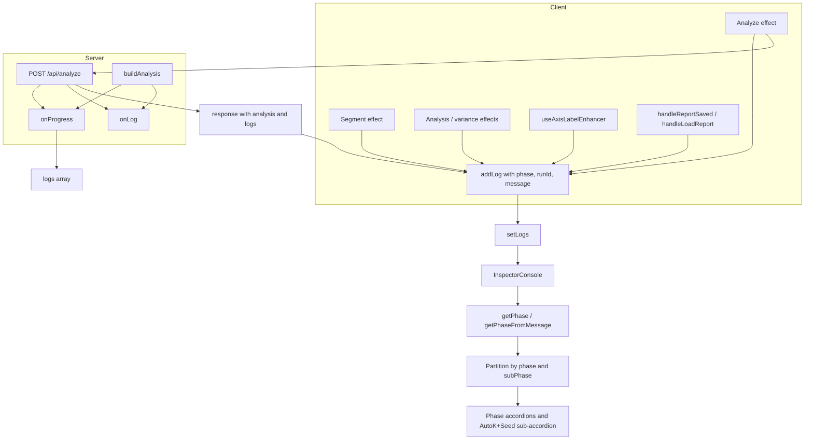

# Console Accordions and Logging Improvements

## 1. Accordion UI in InspectorConsole

**Phase model**

- **Phases (top-level):** Segment, Analysis, Quality, Dimensions, Axis labels, Report, General.
- **Sub-phase:** Only `AutoK+Seed` under Analysis (progress, K=6..9, selected, leaderboard).
- **Default state (smart):** Segment, Analysis, Quality, Dimensions, Axis labels, Report **expanded**; `AutoK+Seed` **collapsed**.

**Phase assignment**

- **At addLog (client):** Pass `data.phase` (and `data.subPhase` when relevant) from:
  - Segment handler: `phase: "segment"`.
  - Analyze handler: `phase: "analysis"` for api_request/response and when merging `data.logs` (after inferring `phase`/`subPhase` for each server log).
  - Analysis effect (keywords, cluster hygiene, variance): `phase: "analysis"` or `"quality"` or `"dimensions"` as appropriate.
  - Variance effect: `phase: "dimensions"`.
  - Axis enhancer: wrap `onAddLog` so every call gets `phase: "axis"`.
  - Report: `phase: "report"` for save/load.
- **For server logs (`data.logs`):** Infer `phase`/`subPhase` in the client when doing `data.logs.forEach` via `getPhaseFromMessage(type, message)`:
  - `subPhase: "AutoK+Seed"` and `phase: "Analysis"` if message matches: `Auto-Seed progress`, `AutoK+Seed K=`, `AutoK+Seed selected`, `Auto-Seed leaderboard`.
  - `phase: "Quality"` for `Primary cut quality`, `Quality warning`.
  - `phase: "Dimensions"` for `Visualization uses`, `Auto dimension`.
  - `phase: "Analysis"` for: `Preparing sentences`, `Chunking feedback`, `Embedding text`, `Optimizing cluster count`, `Clustering concepts`, `Labeling concepts`, `Computing juror vectors`, `PCA + 3D`, `Building graph`, `AutoK+Seed testing K range`, `Two-layer`, `Detail granularity`, `Built hierarchy`, `Concepts:`, `Analysis complete`.
  - `phase: "Segment"` for `Segmenting`, `Text segmented`.
  - `phase: "Axis labels"` for `Enhancing axis labels`, `Axis labels enhanced`.
  - `phase: "Report"` for `Report saved`, `Loaded report`.
  - `phase: "General"` for `node`, `link`, unclassified `api_error`, and generic `info`.

**Rendering**

- Partition `logs` by `phase` (and, for Analysis, split into main vs `subPhase === "AutoK+Seed"`).
- For each non-empty phase, render a **collapsible section** (no existing Accordion in [components/ui](components/ui); add a minimal one or reuse a stateful ChevronDown/ChevronRight pattern as in the current keyword expand).
- **Analysis:** body = non–AutoK+Seed entries; then a **nested** collapsible **AutoK+Seed** with its entries. Analysis section default expanded; AutoK+Seed default collapsed.
- **Header:** phase label, optional count badge, ChevronRight (collapsed) / ChevronDown (expanded). Toggle updates local state; initial `expanded` from a `defaultExpanded(phase, subPhase)` (e.g. `false` only for `AutoK+Seed`).
- **Body:** same per-log row as today (time, icon, message, optional keyword expand). Preserve `logEndRef` and scroll-on-append behavior.
- **Order:** fixed phase order: Segment, Analysis, Quality, Dimensions, Axis labels, Report, General. Within each phase, chronological.

**Files**

- [components/inspector/InspectorConsole.tsx](components/inspector/InspectorConsole.tsx): phase helpers, partitioning, accordion layout, and per-phase state.
- Optionally [components/ui/accordion.tsx](components/ui/accordion.tsx): minimal `AccordionItem({ title, defaultExpanded, children, count })` if we want reuse; otherwise inline in InspectorConsole.

---

## 2. Run IDs and Reducing Duplicate Analyze Runs

**Run IDs**

- **Segment:** at start of segment effect, `segmentRunId = crypto.randomUUID()`. Pass `{ runId: segmentRunId, phase: "segment" }` in `data` for every `addLog` in that effect (request, response, error).
- **Analyze:** at start of `analyze` in the analyze effect, `analyzeRunId = crypto.randomUUID()`. Pass `{ runId: analyzeRunId, phase: "analysis" }` (and inferred `phase`/`subPhase` for server logs) for:
  - `addLog("api_request", "Starting semantic analysis...", { runId, phase: "analysis" })`
  - `addLog("api_response", "Analysis complete: ...", { ...data, runId, phase: "analysis" })`
  - `data.logs.forEach(l => addLog(l.type, l.message, { ...l.data, runId, ...getPhaseFromMessage(l.type, l.message) }))`
- **Analysis result:** `setAnalysis({ ...data.analysis, runId: analyzeRunId })`. Add `runId?: string` to [types/analysis.ts](types/analysis.ts) `AnalysisResult` (or treat as a transient client-only field; both work).
- **Axis enhancer:** pass a wrapper to `useAxisLabelEnhancer` so that `onAddLog` receives `(t, m, d) => addLog(t, m, { ...d, phase: "axis", runId: analysis?.runId })`. Ensures axis logs get the same run as the analysis that triggered them.
- **Report:** no runId required; phase `"report"` is enough.
- **Display:** optional truncated `runId` (e.g. 8 chars) on log rows when `data.runId` exists; can be shown only when there are 2+ distinct runIds to reduce clutter.

**Deduplicating analyze runs**

- In the analyze effect ([app/page.tsx](app/page.tsx)): before `setLoadingAnalysis(true)` and the fetch, compute a **request signature** from the same fields as the request body (e.g. `JSON.stringify({ blocks: jurorBlocks, kConcepts, similarityThreshold, evidenceRankingParams, clusteringMode, autoK, ... })`), excluding `progressId` and `addLog`.
- Maintain `lastStartedSignatureRef = useRef<string | null>(null)`.
- If `lastStartedSignatureRef.current === requestSignature`, return immediately (no fetch).
- Right before `fetch`, set `lastStartedSignatureRef.current = requestSignature`.
- In the effect’s `finally`, set `lastStartedSignatureRef.current = null` so a later run with the same params (e.g. user-triggered) can proceed.
- This prevents double-fires from Strict Mode or dependency churn when the logical request is unchanged.

---

## 3. Richer Error Logging

**Segment** ([app/page.tsx](app/page.tsx) segment effect)

- `!response.ok`:  
  - `const errBody = await response.json().catch(() => ({}));`  
  - `addLog("api_error", `Segmentation failed: ${response.status} ${errBody?.error || response.statusText}`, { phase: "segment", runId: segmentRunId })`
- `catch (err)`:  
  - `addLog("api_error", `Network error during segmentation: ${err instanceof Error ? err.message : String(err)}`, { phase: "segment" })`

**Analyze** (analyze effect in [app/page.tsx](app/page.tsx))

- `!response.ok`:  
  - `addLog("api_error", `Analysis failed: ${response.status} ${errorData?.error || response.statusText}`, { phase: "analysis", runId })`
- `catch (err)`:  
  - `addLog("api_error", `Network error during analysis: ${err instanceof Error ? err.message : String(err)}`, { phase: "analysis", runId })`

**Axis enhancer** ([hooks/useAxisLabelEnhancer.ts](hooks/useAxisLabelEnhancer.ts))

- In `catch`:  
  - `onAddLog("api_error", `Axis label enhancement failed: ${err instanceof Error ? err.message : String(err)}`)`  
  - (Phase/runId come from the wrapper in the page.)

---

## 4. Pipeline Stages in Console

**Analyze route** ([app/api/analyze/route.ts](app/api/analyze/route.ts))

- In the `onProgress` callback, in addition to `if (progressId) emitProgress(...)`, always push to `logs`:
  - `logs.push({ type: "analysis", message: payload.step, data: { progress: payload.progress } });`
- No change to `buildAnalysis` or `progress()` calls. Existing `progress()` in [lib/graph/graph-builder.ts](lib/graph/graph-builder.ts) (e.g. "Preparing sentences", "Chunking feedback", "Embedding text", "Optimizing cluster count", "Clustering concepts", "Labeling concepts", "Computing juror vectors", "PCA + 3D vectors", "Building graph") will then appear in `data.logs` and be shown in the Analysis phase.

**Phase mapping**

- `getPhaseFromMessage` will map those `message` values to `phase: "Analysis"` (and, where applicable, `subPhase: "AutoK+Seed"` only for the AutoK+Seed-specific strings).

---

## 5. Quality: Which Concepts Violate, One-Line `valid`, Hint

**cut-constraints** ([lib/analysis/cut-constraints.ts](lib/analysis/cut-constraints.ts))

- Extend `CutQualityScore` with `violatingClusterIndices?: number[]`.
- After the loop that computes `supportViolations` and `jurorSupport`, set:
  - `violatingClusterIndices = jurorSupport.map((s, i) => (s < minJurorSupportPerConcept ? i : -1)).filter(i => i >= 0)`.
- Include it in the returned object.

**graph-builder** ([lib/graph/graph-builder.ts](lib/graph/graph-builder.ts))

- **Primary cut quality line:** when `!quality.isValid` and `quality.penalties.supportViolations > 0`, append a short reason, e.g.  
  - `... valid=${quality.isValid} (${quality.penalties.supportViolations} below minJurorSupport)`
- **Quality warning line:** include cluster indices when available:  
  - `Quality warning: ${n} primary concepts (clusters ${quality.violatingClusterIndices?.join(", ") ?? "—"}) violate minJurorSupport`
- **Hint (new `log("quality", ...)`):** when `!quality.isValid && quality.penalties.supportViolations > 0`:
  - `log("quality", "Consider relaxing minJurorSupport or adding more jurors.")`  
  - (Optional: only if a `cutQualityParams` or feature flag allows “hints”; otherwise always.)

---

## 6. Deduplication and Wording

**Single “Analysis complete”**

- In the analyze effect: replace  
  - `addLog("api_response", "Analysis complete", data)`  
  - with  
  - `addLog("api_response", `Analysis complete: ${data.analysis.stats.totalSentences} sentences, ${data.analysis.stats.totalConcepts} concepts`, { ...data, runId, phase: "analysis" })`
- In the analysis `useEffect` (keyword/analysis/quality/variance): **remove** the `addLog("analysis", "Analysis complete: ... sentences, ... concepts")` line to avoid duplication.

**“Concepts” instead of “Keywords”**

- In that same analysis effect, change:
  - `addLog("keyword", `Keywords extracted: ${allKeywords.length} keywords from ${analysis.stats.totalSentences} sentences`, ...)`  
  - to  
  - `addLog("keyword", `Concepts: ${allKeywords.length} concepts from ${analysis.stats.totalSentences} sentences`, { ...data, phase: "analysis" })`  
  - (Keep `type: "keyword"` so the icon stays; or switch to `"analysis"` if preferred; plan assumes we keep `"keyword"` for now.)

**Single variance line**

- In the analysis effect, only add  
  - `addLog("analysis", `Visualization uses ${cumulative.length} dimensions, capturing ${percent}% of data variance.`)`  
  - when `dimensionMode === "manual"`. When `dimensionMode` is `"elbow"` or `"threshold"`, omit it; the separate variance effect’s “Auto dimension (elbow) chose …” line remains the single source for that case.

---

## 7. AutoK+Seed: Always Reduced (No Verbose Toggle)

**graph-builder** ([lib/graph/graph-builder.ts](lib/graph/graph-builder.ts))

- **AutoK+Seed progress (with `evaluateKRangeWithAutoSeed`):**  
  - In the `onProgress` passed to `evaluateKRangeWithAutoSeed`, only call `log(...)` when `evaluated === total` (i.e. 64/64), not when `evaluated % progressInterval === 0`.  
  - Effect: one “Auto-Seed progress (K=X): 64/64 seeds evaluated, best=…” per K (4 lines total for K 6–9) instead of 16.
- **AutoK+Seed leaderboard:**  
  - Change `seedLeaderboard.slice(0, 5)` to `seedLeaderboard.slice(0, 1)` so only the top seed is logged.
- **Non–AutoK Auto-Seed path** (when `!autoK && autoSeedEnabled`):  
  - In `onProgress`, only log when `evaluated === total`.  
  - For the leaderboard, `slice(0, 1)` instead of `slice(0, 5)`.

---

## 8. Report Saved: Include `id`

**handleReportSaved** ([app/page.tsx](app/page.tsx))

- Change  
  - `addLog("info", `Report saved: ${report.name}`)`  
  - to  
  - `addLog("info", `Report saved: ${report.name} (id: ${report.id})`, { phase: "report" })`

**handleLoadReport**

- Change  
  - `addLog("info", `Loaded report: ${report.name}`)`  
  - to  
  - `addLog("info", `Loaded report: ${report.name} (id: ${report.id})`, { phase: "report" })`

(SavedReport already has `id` from [components/inspector/AnalysisReport.tsx](components/inspector/AnalysisReport.tsx) and [lib/utils/report-storage.ts](lib/utils/report-storage.ts).)

---

## 9. Data Flow (High Level)

---

## 10. File Checklist

| File | Changes |

|------|---------|

| [components/inspector/InspectorConsole.tsx](components/inspector/InspectorConsole.tsx) | Phase/subPhase helpers, `getPhaseFromMessage`, partition logs, accordion layout, Analysis + AutoK+Seed nesting, smart default expanded state, optional runId on rows |

| [components/ui/accordion.tsx](components/ui/accordion.tsx) | Optional: minimal `AccordionItem`; otherwise inline collapsible in InspectorConsole |

| [app/page.tsx](app/page.tsx) | Segment: runId, phase, richer api_error; Analyze: runId, phase, request-signature dedup, single “Analysis complete” with stats, merge `data.logs` with `getPhaseFromMessage`; Analysis effect: remove duplicate “Analysis complete”, “Concepts” wording, “Visualization uses” only when manual; Variance effect: phase “dimensions”; Report: “(id: …)” and phase “report”; wrap `onAddLog` for axis with phase and `analysis?.runId` |

| [app/api/analyze/route.ts](app/api/analyze/route.ts) | In `onProgress`, always `logs.push({ type: "analysis", message: payload.step, data: { progress: payload.progress } })` |

| [lib/graph/graph-builder.ts](lib/graph/graph-builder.ts) | AutoK+Seed: log progress only when `evaluated === total`; leaderboard `slice(0, 1)`; same for non–AutoK Auto-Seed; quality: append `(n below minJurorSupport)` to primary cut line, include `violatingClusterIndices` in warning, add hint `log` when support violations |

| [lib/analysis/cut-constraints.ts](lib/analysis/cut-constraints.ts) | Add `violatingClusterIndices: number[]` to `CutQualityScore` and compute from `jurorSupport` and `minJurorSupportPerConcept` |

| [hooks/useAxisLabelEnhancer.ts](hooks/useAxisLabelEnhancer.ts) | In `catch`, `onAddLog("api_error", `Axis label enhancement failed: ${err instanceof Error ? err.message : String(err)}`)` |

| [types/analysis.ts](types/analysis.ts) | Optional: `runId?: string` on `AnalysisResult` for typing `setAnalysis({ ...data.analysis, runId })` |

---

## 11. Testing and Manual Checks

- Run a full flow: paste text, segment, analyze (with AutoK and Auto-Seed), enable axis labels, save and load a report. Confirm:
  - Accordions: Segment, Analysis (with collapsible AutoK+Seed), Quality, Dimensions, Axis labels, Report appear and expand/collapse as specified; AutoK+Seed stays collapsed by default.
  - Only one “Analysis complete: X sentences, Y concepts” and one variance line (manual vs auto).
  - “Concepts: X concepts from Y sentences” and reduced AutoK+Seed lines (one progress per K, leaderboard #1 only).
  - Pipeline stages (Preparing sentences, Chunking, Embedding, etc.) in Analysis.
  - Quality: primary cut line with `(n below minJurorSupport)`, warning with cluster indices, and the hint when applicable.
  - Errors: segment/analyze/axis failures show status and message or `err.message`.
  - Report: “Report saved: … (id: …)” and “Loaded report: … (id: …)”.
  - No duplicate analyze runs when deps are stable (e.g. Strict Mode); runId present on analyze and axis logs.