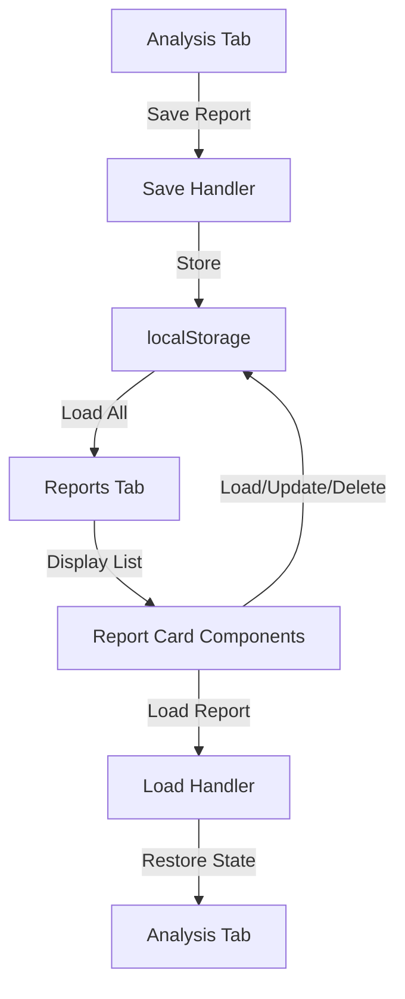

# Reports Tab CRUD Implementation Plan

## Overview

Add a "Reports" tab to the bottom InspectorPanel alongside Console and Analysis tabs. Users can save analysis snapshots as reports and perform CRUD operations (Create, Read, Update, Delete) on saved reports stored in localStorage.

## Architecture

### Data Flow

## Implementation Steps

### 1. Type Definitions

**File**: `types/analysis.ts`

Add new interfaces for saved reports:

- `SavedReport` interface containing:
  - `id`: string (UUID)
  - `name`: string (user-provided or auto-generated)
  - `createdAt`: string (ISO timestamp)
  - `updatedAt`: string (ISO timestamp)
  - `analysis`: AnalysisResult (full snapshot)
  - `jurorBlocks`: JurorBlock[]
  - `rawText`: string
  - `parameters`: ExportAnalysisParams (from RawDataExportContext)
  - `metadata`: { stats preview, concept count, etc. }

### 2. Local Storage Utility

**File**: `lib/utils/report-storage.ts`

Create utility functions for CRUD operations:

- `getAllReports()`: Retrieve all saved reports from localStorage
- `getReport(id: string)`: Retrieve a single report by ID
- `saveReport(report: SavedReport)`: Save or update a report (key: `semi-chan-reports`)
- `deleteReport(id: string)`: Delete a report by ID
- `updateReport(id: string, updates: Partial<SavedReport>)`: Update report fields
- Handle localStorage errors (quota exceeded, etc.)

Storage key: `semi-chan-reports` (array of SavedReport objects)

### 3. Reports Component

**File**: `components/inspector/ReportsList.tsx`

Create the Reports list view component:

- Display list of saved reports as cards
- Each card shows:
  - Report name/title
  - Created/updated timestamps
  - Parameter preview (kConcepts, numDimensions, clusteringMode, etc.)
  - Stats preview (concepts, sentences, jurors counts)
  - CRUD action buttons (Edit, Delete, Load)
- Empty state when no reports exist
- Loading state during operations

### 4. Update InspectorPanel

**File**: `components/inspector/InspectorPanel.tsx`

- Update `InspectorTab` type: `"console" | "analysis" | "reports"`
- Add Reports tab button (icon: `FileText` from lucide-react)
- Add Reports tab content section rendering `ReportsList` component
- Pass necessary props to `ReportsList` (callbacks for loading reports)

### 5. Save Report Functionality

**File**: `components/inspector/AnalysisReport.tsx`

Add "Save Report" button/action:

- Button in header or action area of AnalysisReport
- Click handler that:
  - Generates unique ID (UUID)
  - Creates SavedReport from current analysis state + rawExportContext
  - Prompts user for report name (or auto-generate: "Report YYYY-MM-DD HH:mm")
  - Calls `saveReport()` utility
  - Shows success/error feedback

### 6. Load Report Functionality

**File**: `app/page.tsx`

Add report loading capability:

- New state/callback handlers to restore analysis state from SavedReport
- When user clicks "Load" on a report card:
  - Restore `analysis` state from `report.analysis`
  - Restore `jurorBlocks` from `report.jurorBlocks`
  - Restore `rawText` from `report.rawText`
  - Restore analysis parameters from `report.parameters`
  - Switch to Analysis tab
  - Show success feedback

### 7. Update Report Functionality

**File**: `components/inspector/ReportsList.tsx`

- Edit button on report card opens modal/dialog
- Allow user to rename report
- Save updated report via `updateReport()` utility

### 8. Delete Report Functionality

**File**: `components/inspector/ReportsList.tsx`

- Delete button on report card
- Confirmation dialog before deletion
- Call `deleteReport()` utility
- Refresh list after deletion

## File Changes Summary

### New Files

- `components/inspector/ReportsList.tsx` - Reports list view component
- `lib/utils/report-storage.ts` - LocalStorage CRUD utilities

### Modified Files

- `components/inspector/InspectorPanel.tsx` - Add Reports tab
- `components/inspector/AnalysisReport.tsx` - Add Save Report button
- `types/analysis.ts` - Add SavedReport interface
- `app/page.tsx` - Add report loading handlers

## Key Considerations

1. **Storage Limits**: localStorage typically 5-10MB. Large analysis results may hit limits. Consider:

   - Compression or selective storage (store only essential data)
   - Warning users about storage limits
   - Future: backend storage option

2. **Data Serialization**: AnalysisResult may contain complex objects (Float64Array, etc.). Ensure proper serialization/deserialization.

3. **Parameter Restoration**: When loading a report, restore all analysis parameters to match the saved configuration.

4. **Naming**: Auto-generate report names if user doesn't provide one (e.g., "Analysis 2024-01-15 14:30").

5. **Error Handling**: Handle localStorage errors gracefully (quota exceeded, disabled, etc.).

6. **UI Feedback**: Show loading states, success messages, and error messages for all CRUD operations.

## Testing Checklist

- [ ] Save report with auto-generated name
- [ ] Save report with custom name
- [ ] List all saved reports
- [ ] View report preview details
- [ ] Load saved report (restores analysis state)
- [ ] Update report name
- [ ] Delete report with confirmation
- [ ] Handle localStorage quota exceeded error
- [ ] Empty state when no reports exist
- [ ] Multiple reports display correctly

## Future Enhancements (Not in Scope)

- Backend API for server-side report storage
- Report export/import (JSON files)
- Report sharing/permissions
- Report versioning/history